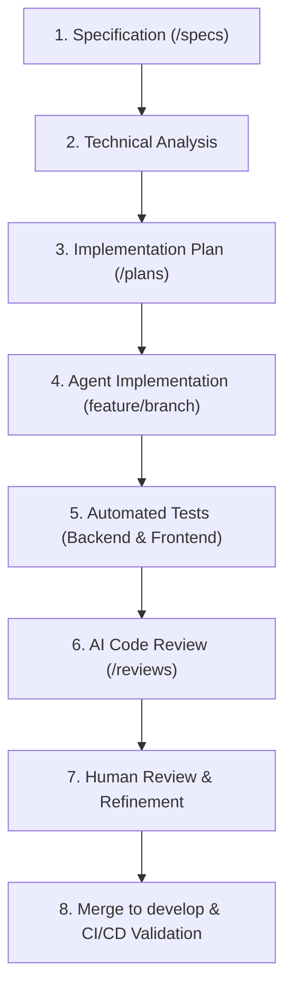
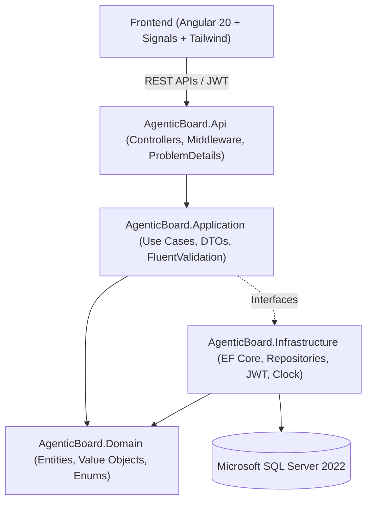

# AgenticBoard

[](https://github.com/brian-silvestri/AgenticBoard/actions/workflows/ci.yml)
[](https://dotnet.microsoft.com/)
[](https://angular.dev/)
[](https://www.microsoft.com/sql-server)
[](https://tailwindcss.com/)
[](https://www.docker.com/)
[](LICENSE)

> **AgenticBoard** is a modern, enterprise-ready project and task management system (inspired by Jira/Trello) built to demonstrate professional Full-Stack engineering and an exemplary **spec-driven, AI-first / agentic development methodology**.

---

## 🎯 Why This Project Exists

In modern engineering, the integration of AI coding agents into the software development lifecycle requires rigorous engineering discipline, rather than unchecked code generation.

**AgenticBoard** was created to demonstrate:
- **Full-Stack Mastery**: High-performance backend in **ASP.NET Core .NET 8** with Clean Architecture paired with a reactive, modular **Angular 20** frontend using Standalone Components, Signals, and Tailwind CSS.
- **Spec-Driven Engineering**: No code is written in isolation. Every feature originates from an explicit specification, progresses through a technical architecture plan, and is verified against strict business rules.
- **AI-First / Agentic Workflow**: Coding agents are treated as high-velocity implementers operating within strict constraints ([`AGENTS.md`](./AGENTS.md)), producing automated tests, performing static code reviews, and leaving an auditable review trail.
- **Enterprise Standards**: Robust JWT authentication, project-membership multi-tenancy, granular RBAC (Owner vs. Member), audit trails, RFC 7807 `ProblemDetails`, Docker containerization, and GitHub Actions CI.

---

## 🔄 Agentic Development Workflow

This project demonstrates a **spec-driven, AI-first software development workflow**. Coding agents are utilized for structured implementation only after requirements and technical architecture plans are firmly established. Generated changes are continuously validated through automated unit/integration tests, static analysis, multi-stage code reviews, and human engineering judgment.



---

## 🏗 System Architecture

The backend adheres strictly to **Clean Architecture** principles, enforcing separation of concerns and dependency inversion.



### Layer Breakdown
1. **AgenticBoard.Domain**: Pure business entities (`User`, `Project`, `ProjectMember`, `TaskItem`, `TaskComment`, `AuditLog`), enums, and domain invariants. Zero third-party dependencies.
2. **AgenticBoard.Application**: Application services, CQRS-style handlers, data transfer objects, FluentValidation rules, and repository abstractions.
3. **AgenticBoard.Infrastructure**: EF Core `DbContext`, database migrations, SQL Server provider configuration, cryptographic password hashing, and JWT token issuance.
4. **AgenticBoard.Api**: ASP.NET Core Web API controllers, custom exception handling middleware producing RFC 7807 `ProblemDetails`, Swagger/OpenAPI documentation, CORS, and health checks.
5. **AgenticBoard.Tests**: Unit and integration test suites covering authentication, project membership boundaries, task state transitions, and audit logging.

---

## ✨ Core Features

- 🔐 **Authentication & Security**: Secure user registration, login, PBKDF2/BCrypt password hashing, JWT bearer tokens, and route protection.
- 📁 **Project Management**: Multi-user project creation, role-based membership (`Owner` vs. `Member`), member management, and tenant isolation.
- 📋 **Task Management**: Full task lifecycle (`Backlog`, `Todo`, `InProgress`, `Review`, `Done`), priority levels (`Low`, `Medium`, `High`, `Critical`), and assignment validation.
- 📊 **Kanban Board**: Dynamic Kanban view with Angular CDK Drag & Drop, state persistence, and real-time column grouping.
- 💬 **Task Discussions**: Rich comment stream per task with author attribution, timestamps, and membership security.
- 📜 **Auditable Activity Log**: Automatic auditing of significant domain events (`TaskCreated`, `StatusChanged`, `PriorityChanged`, `AssignedUserChanged`, `CommentAdded`, etc.).
- 🐳 **Docker & DevOps**: Multi-stage Dockerfiles for backend and frontend, `docker-compose` environment with SQL Server, and automated GitHub Actions CI pipeline.

---

## 📂 Repository Structure

```text
.
├── .github/workflows/      # Automated CI/CD pipelines
├── specs/                  # Formal specifications (spec-driven development)
│   ├── 001-authentication.md
│   ├── 002-project-management.md
│   ├── 003-task-management.md
│   ├── 004-kanban-board.md
│   ├── 005-comments.md
│   └── 006-audit-log.md
├── plans/                  # Technical implementation plans
├── reviews/                # Post-implementation AI/Agent code reviews
├── backend/
│   ├── AgenticBoard.Api/            # ASP.NET Core Web API host
│   ├── AgenticBoard.Application/    # Business logic, DTOs, validations
│   ├── AgenticBoard.Domain/         # Core domain entities & enums
│   ├── AgenticBoard.Infrastructure/ # EF Core, DB migrations, JWT
│   ├── AgenticBoard.Tests/          # Unit & integration test suites
│   ├── AgenticBoard.sln             # .NET 8 Solution
│   └── Dockerfile                   # Multi-stage backend build
├── frontend/
│   ├── src/                         # Angular 20 Standalone source
│   ├── Dockerfile                   # Nginx production build
│   └── nginx.conf                   # Reverse proxy & SPA routing
├── docker-compose.yml       # Local containerized orchestration
├── AGENTS.md                # Agent instructions & strict engineering rules
├── CONTRIBUTING.md          # Contribution guidelines
├── LICENSE                  # MIT License
└── README.md                # Project documentation
```

---

## 🚀 Getting Started

### Prerequisites
- [.NET 8 SDK](https://dotnet.microsoft.com/download/dotnet/8.0)
- [Node.js (v20+ or v22+)](https://nodejs.org/)
- [Docker & Docker Compose](https://www.docker.com/)

---

### Running with Docker Compose (Recommended)

To run the entire system (SQL Server, .NET API, and Angular Frontend) in isolated containers:

```bash
docker compose up -d --build
```

- **Frontend**: [http://localhost:4200](http://localhost:4200)
- **Backend API & Swagger**: [http://localhost:5000/swagger](http://localhost:5000/swagger)
- **SQL Server**: `localhost:1433`

---

### Running Locally for Development

#### 1. Start SQL Server (or use Docker)
```bash
docker run -e "ACCEPT_EULA=Y" -e "MSSQL_SA_PASSWORD=AgenticBoard@Pass123" -p 1433:1433 --name agenticboard-sql -d mcr.microsoft.com/mssql/server:2022-latest
```

#### 2. Run Backend
```bash
cd backend
dotnet restore
dotnet ef database update --project AgenticBoard.Infrastructure --startup-project AgenticBoard.Api
dotnet run --project AgenticBoard.Api
```
The API will be available at `http://localhost:5000` (or `https://localhost:5001`).

#### 3. Run Frontend
```bash
cd frontend
npm install
npm start
```
The application will launch at `http://localhost:4200`.

---

## 🧪 Testing

### Backend Unit & Integration Tests
```bash
cd backend
dotnet test --logger "console;verbosity=detailed"
```

### Frontend Tests
```bash
cd frontend
npm test -- --watch=false --browsers=ChromeHeadless
```

---

## 🔒 Security Architecture

- **Zero-Trust Backend**: Frontend guards protect UX; the backend validates every request's JWT identity and verifies that the user is an active member or owner of the target project before mutating or querying data.
- **Cryptographic Password Security**: Passwords are never stored in plaintext and are hashed using secure salted PBKDF2/BCrypt.
- **Centralized Exception Handling**: Production environments return standardized RFC 7807 `ProblemDetails` payloads without exposing internal stack traces or database schema details.
- **Input Sanitization & Validation**: All incoming requests pass through strict `FluentValidation` pipelines before hitting domain logic.

---

## 📄 License

This project is open-source under the [MIT License](LICENSE).
