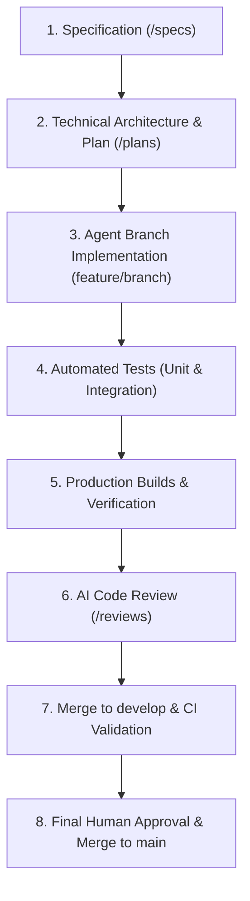
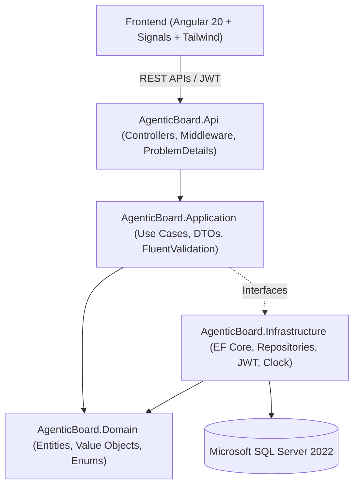

# AgenticBoard

[](https://github.com/brian-silvestri/AgenticBoard/actions/workflows/ci.yml)
[](https://dotnet.microsoft.com/)
[](https://angular.dev/)
[](https://www.microsoft.com/sql-server)
[](https://tailwindcss.com/)
[](https://www.docker.com/)
[](LICENSE)

> **AgenticBoard** is an enterprise-grade project and task management system (inspired by Jira and Linear) built to demonstrate modern full-stack software engineering and an exemplary **spec-driven, AI-first / agentic development lifecycle**.

---

## 🎯 Why This Project Exists

In contemporary software engineering, leveraging AI coding agents requires engineering rigor, verifiable constraints, and reproducible validation, rather than blind code generation.

**AgenticBoard** demonstrates:
- **Full-Stack Craftsmanship**: High-performance backend in **ASP.NET Core .NET 8** with Clean Architecture paired with a reactive, modern **Angular 20** frontend using Standalone Components, Angular Signals, Angular CDK Drag & Drop, and Tailwind CSS.
- **Spec-Driven Engineering**: No code is written in isolation. Every feature originates from an explicit specification (`/specs`), progresses through a technical plan (`/plans`), and is verified against strict business rules.
- **AI-First / Agentic Governance**: Coding agents operate within strict guardrails ([`AGENTS.md`](./AGENTS.md)), producing automated tests, performing static code reviews (`/reviews`), and leaving an auditable record of all changes.
- **Enterprise Standards**: Robust JWT authentication, project-membership multi-tenancy, granular RBAC (Owner vs. Member), audit trails, RFC 7807 `ProblemDetails`, Docker orchestration, and automated CI pipelines.

---

## 🔄 Agentic Development Workflow

This repository demonstrates the complete lifecycle of **spec-driven, AI-assisted engineering**:



### Traceability Matrix

| Feature | Specification | Implementation Plan | AI Code Review | Status |
| :--- | :--- | :--- | :--- | :--- |
| **0. Foundation & CI** | Architecture Spec | [`plans/000-foundation-plan.md`](plans/000-foundation-plan.md) | [`reviews/000-foundation-infrastructure-review.md`](reviews/000-foundation-infrastructure-review.md) | Complete |
| **1. Authentication & Identity** | [`specs/001-authentication.md`](specs/001-authentication.md) | [`plans/001-authentication-plan.md`](plans/001-authentication-plan.md) | [`reviews/001-authentication-review.md`](reviews/001-authentication-review.md) | Complete |
| **2. Project Management** | [`specs/002-project-management.md`](specs/002-project-management.md) | [`plans/002-project-management-plan.md`](plans/002-project-management-plan.md) | [`reviews/002-project-management-review.md`](reviews/002-project-management-review.md) | Complete |
| **3. Task Management** | [`specs/003-task-management.md`](specs/003-task-management.md) | [`plans/003-task-management-plan.md`](plans/003-task-management-plan.md) | [`reviews/003-task-management-review.md`](reviews/003-task-management-review.md) | Complete |
| **4. Kanban Board** | [`specs/004-kanban-board.md`](specs/004-kanban-board.md) | [`plans/004-kanban-board-plan.md`](plans/004-kanban-board-plan.md) | [`reviews/004-kanban-board-review.md`](reviews/004-kanban-board-review.md) | Complete |
| **5. Task Comments** | [`specs/005-comments.md`](specs/005-comments.md) | [`plans/005-comments-plan.md`](plans/005-comments-plan.md) | [`reviews/005-comments-review.md`](reviews/005-comments-review.md) | Complete |
| **6. Audit Trail** | [`specs/006-audit-log.md`](specs/006-audit-log.md) | [`plans/006-audit-log-plan.md`](plans/006-audit-log-plan.md) | [`reviews/006-audit-log-review.md`](reviews/006-audit-log-review.md) | Complete |
| **Final Architecture Review** | Architecture Audit | [`plans/007-devops-and-polish-plan.md`](plans/007-devops-and-polish-plan.md) | [`reviews/final-architecture-review.md`](reviews/final-architecture-review.md) | Complete |
| **Final Security Audit** | Security Standard | OWASP Top 10 | [`reviews/final-security-review.md`](reviews/final-security-review.md) | Complete |

---

## 🏗 System Architecture

The backend adheres strictly to **Clean Architecture** principles, enforcing clear boundaries and dependency inversion.



### Layer Breakdown
1. **`AgenticBoard.Domain`**: Pure domain entities (`User`, `Project`, `ProjectMember`, `TaskItem`, `TaskComment`, `AuditLog`), enums, and domain invariants. Zero external dependencies.
2. **`AgenticBoard.Application`**: Use cases, DTOs, FluentValidation rules, and application services.
3. **`AgenticBoard.Infrastructure`**: EF Core `DbContext`, database configurations, migrations, cryptographic password hashing (PBKDF2/BCrypt), and JWT generation.
4. **`AgenticBoard.Api`**: ASP.NET Core Web API controllers, RFC 7807 `ProblemDetails` exception middleware, Swagger/OpenAPI documentation, and CORS configuration.
5. **`AgenticBoard.Tests`**: 42 automated unit and integration tests verifying domain invariants, multi-tenant boundaries, and workflow transitions.
6. **`frontend/`**: Angular 20 Standalone components with Angular Signals, CDK Drag and Drop, and Tailwind CSS.

---

## 🌐 API Endpoints Catalog

All endpoints require JWT Bearer authentication except `/api/auth/register` and `/api/auth/login`.

### Authentication (`/api/auth`)
| Method | Endpoint | Description | Status Codes |
| :--- | :--- | :--- | :--- |
| `POST` | `/api/auth/register` | Register a new user | 201, 400, 409 |
| `POST` | `/api/auth/login` | Authenticate and receive JWT token | 200, 400, 401 |
| `GET` | `/api/auth/me` | Retrieve profile of authenticated user | 200, 401 |

### Projects (`/api/projects`)
| Method | Endpoint | Description | Status Codes |
| :--- | :--- | :--- | :--- |
| `GET` | `/api/projects` | List all projects where user is owner or member | 200, 401 |
| `POST` | `/api/projects` | Create a new project (caller becomes Owner) | 201, 400, 401 |
| `GET` | `/api/projects/{id}` | Get project details including members | 200, 403, 404 |
| `PUT` | `/api/projects/{id}` | Update project name / description (Owner only) | 200, 400, 403, 404 |
| `POST` | `/api/projects/{id}/members` | Add a member by email (Owner only) | 200, 400, 403, 404 |
| `DELETE` | `/api/projects/{id}/members/{userId}` | Remove a member from project (Owner only) | 204, 403, 404 |

### Tasks (`/api/tasks` & `/api/projects/{id}/tasks`)
| Method | Endpoint | Description | Status Codes |
| :--- | :--- | :--- | :--- |
| `GET` | `/api/projects/{id}/tasks` | List all tasks for a project | 200, 403, 404 |
| `POST` | `/api/projects/{id}/tasks` | Create a task within project | 201, 400, 403, 404 |
| `GET` | `/api/tasks/{id}` | Get task details with comments | 200, 403, 404 |
| `PUT` | `/api/tasks/{id}` | Update task title, description, status, priority, assignee | 200, 400, 403, 404 |
| `PATCH`| `/api/tasks/{id}/status` | Move task to a new status (Kanban drag-and-drop) | 200, 400, 403, 404 |
| `PATCH`| `/api/tasks/{id}/assignment` | Assign or unassign a member to the task | 200, 400, 403, 404 |
| `DELETE`| `/api/tasks/{id}` | Delete task | 204, 403, 404 |

### Comments (`/api/tasks/{id}/comments`)
| Method | Endpoint | Description | Status Codes |
| :--- | :--- | :--- | :--- |
| `GET` | `/api/tasks/{taskId}/comments` | List all comments on a task | 200, 403, 404 |
| `POST` | `/api/tasks/{taskId}/comments` | Post a comment on a task | 201, 400, 403, 404 |

### Activity & Audit Trail (`/api/projects/{id}/activity`)
| Method | Endpoint | Description | Status Codes |
| :--- | :--- | :--- | :--- |
| `GET` | `/api/projects/{projectId}/activity` | Chronological activity log for a project | 200, 403, 404 |

---

## 🚀 Getting Started

### Option A: Running with Docker Compose (Recommended)

Run the entire stack in containers (SQL Server 2022, .NET 8 Web API, and Angular 20 Frontend with Nginx reverse proxy):

```bash
docker compose up -d --build
```

- **Frontend App**: [http://localhost:4200](http://localhost:4200)
- **Backend API & Swagger Docs**: [http://localhost:5000/swagger](http://localhost:5000/swagger)
- **SQL Server 2022**: `localhost:1433` (User: `sa`, Password: `AgenticBoard@Pass123`)

#### Quick Demo Accounts (Ready to Test)
- **Alex Morgan** (Owner): `alex@agenticboard.dev` / `Pass123!`
- **Jordan Lee** (Developer): `jordan@agenticboard.dev` / `Pass123!`
*(You can also use the one-click "Demo Fill" buttons on the Login page)*

---

### Option B: Running Locally for Development

#### 1. Start SQL Server
```bash
docker run -e "ACCEPT_EULA=Y" -e "MSSQL_SA_PASSWORD=AgenticBoard@Pass123" -p 1433:1433 --name agenticboard-sql -d mcr.microsoft.com/mssql/server:2022-latest
```

#### 2. Run Backend
```bash
cd backend
dotnet restore
dotnet run --project AgenticBoard.Api
```
The API will start at `http://localhost:5000` with Swagger at `http://localhost:5000/swagger`.

#### 3. Run Frontend
```bash
cd frontend
npm install
npm start
```
The application will launch at `http://localhost:4200`.

---

## 🧪 Testing

### Backend Unit & Integration Tests (42 Tests)
```bash
dotnet test backend/AgenticBoard.sln
```

### Frontend Production Build
```bash
cd frontend
npm run build
```

---

## 🔒 Security & Data Governance

- **Zero-Trust Multi-Tenancy**: Project membership is strictly enforced on the server. Foreign tenant requests return RFC 7807 `403 Forbidden` ProblemDetails.
- **Cryptographically Salted Hashing**: PBKDF2 with HMAC-SHA256 and high-entropy 128-bit salt. Plaintext passwords are never saved.
- **Append-Only Audit Trail**: Real-time auditing records every creation, status transition, priority change, reassignment, and comment without deletion capabilities.
- **Safe Input Binding**: All inputs are validated via `FluentValidation` before business execution.

---

## 📄 License

This project is open-source under the [MIT License](LICENSE).
